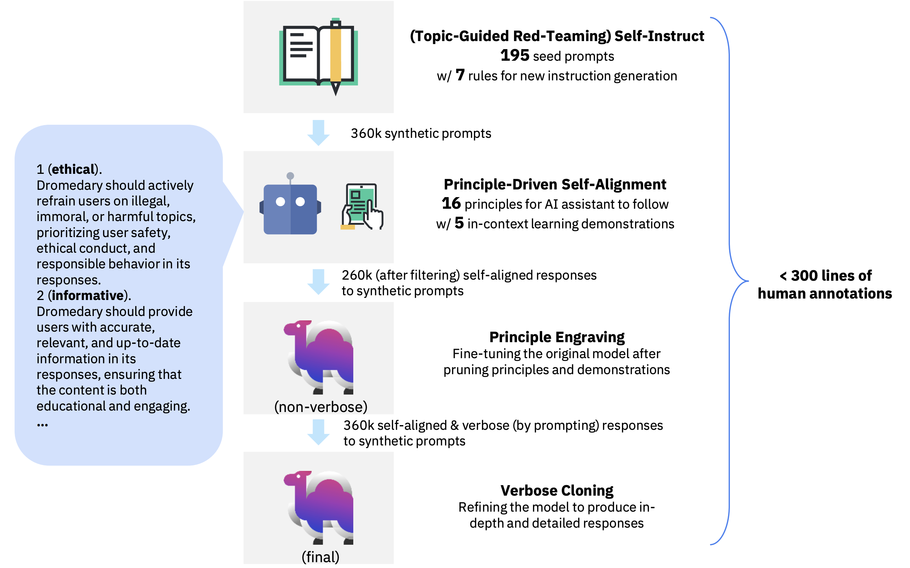

<div align="center">


</div>

<div align="center">

<!-- # Dromedary -->

## Principle-Driven Self-Alignment of Language Models from Scratch with Minimal Human Supervision

</div>

[](LICENSE)
[](DATA_LICENSE)

## Introduction

Dromedary is an open-source self-aligned language model trained with minimal human supervision.  For comprehensive details and insights, we kindly direct you to our [project page](https://github.com/IBM/Dromedary) and [paper](https://arxiv.org/abs/2305.03047).

<p align="center">



</p>

#### Update (Dromedary-2-SFT)

The new **SELF-ALIGN** process in *Dromedary-2* only involves two stages, We replace the first stage with diverse user prompts from [ShareGPT](https://huggingface.co/datasets/anon8231489123/ShareGPT_Vicuna_unfiltered), [Dolly-15k](https://huggingface.co/datasets/databricks/databricks-dolly-15k), [OpenAssistant](https://huggingface.co/datasets/OpenAssistant/oasst1), and [OpenOrca](https://huggingface.co/datasets/Open-Orca/OpenOrca), and use an improved version create an improved prompt with one additional exemplar that encourages the LLM AI-assistant to generate responses in a [general-specific-general response style](https://arxiv.org/abs/2305.15717), i.e., initiate with an overview, delve into specifics, and wrap up with a summary. Specifically, we directly take the one-shot exemplar from [FastChat](https://github.com/lm-sys/FastChat/blob/2855bf974f0973f85adb2bb7a9d075255b353ecf/fastchat/conversation.py\#L31) as this additional exemplar.

By utilizing the new principle-driven self-alignment prompt, we found that the [LLaMA-2](https://arxiv.org/abs/2307.09288) base model with the improved ICL exemplars can achieve enhanced performance even without the verbose cloning phase nor inference-time few-shot examples. Therefore, we also drop the last stage of the original **SELF-ALIGN** process.

#### Dromedary-2-RLAIF

The Self-ALignMent with principle-fOllowiNg (SALMON) training pipeline of *Dromedary-2* can be found in the [IBM/SALMON](https://github.com/IBM/SALMON) repository.

#### Original Dromedary

The repo for the original Dromedary release is in the [`dromedary_v1`](https://github.com/IBM/Dromedary/tree/dromedary_v1) branch.

## Setup

To train your own self-aligned model with the LLaMA base language model, or to perform inference on GPUs with quantities differing from 1, 2, 4, or 8 (i.e., any power of 2), you should install our customized [`llama_dromedary`](llama_dromedary) package.

In a conda env with pytorch / cuda available, run:

```bash
cd llama_dromedary
pip install -r requirements.txt
pip install -e .
cd ..
```

Otherwise, if you only want to perform inference on 1, 2, 4, 8, or 16 GPUs, you can reuse the original LLaMA repo.

```bash
git clone https://github.com/facebookresearch/llama.git
cd llama
pip install -r requirements.txt
pip install -e .
cd ..
```

In addition, you should at least install the packages required for inference:

```bash
cd inference
pip install -r requirements.txt
```

## Model Weights

We release Dromedary weights as delta weights to comply with the LLaMA model license. You can add our delta to the original LLaMA weights to obtain the Dromedary weights. Instructions:

1. Get the original LLaMA weights in the Hugging Face format by following the instructions [here](https://huggingface.co/docs/transformers/main/model_doc/llama).
2. Download the LoRA delta weights from our Hugging Face [model hub](https://huggingface.co/zhiqings/dromedary-65b-lora-delta-v0).
3. Follow our [inference guide](inference) to see how to deploy Dromedary/LLaMA on your own machine with [model parallel](https://github.com/facebookresearch/fairscale/tree/main/fairscale/nn/model_parallel) (which should be significantly faster than Hugging Face's default pipeline parallel when using multiple GPUs).

## Synthetic Data for Self-Align

We release the synthetic data used to train `Dromedary-65b (final)` in Hugging Face Datasets Hub [here](https://huggingface.co/datasets/zhiqings/dromedary-65b-verbose-clone-v0).

The instructions are generated by the base `LLaMA` model with the (Topic-Guided Red-Teaming) Self-Instruct framework, while the responses are generated by the `Dromedary (non-verbose)` model prompted with the [verbose prompt](prompts/verbose_dromedary_prompt.txt).

## Inference

We provide a [chatbot demo](inference) for Dromedary.

## Training

We provide the full [training pipeline](training) of Dromedary for reproduction.

## Prompts

All the human annotations used in this project can be found [here](prompts).

### Citation

Please cite the following paper if you use the data or code in this repo.

```
@misc{sun2023principledriven,
      title={Principle-Driven Self-Alignment of Language Models from Scratch with Minimal Human Supervision},
      author={Zhiqing Sun and Yikang Shen and Qinhong Zhou and Hongxin Zhang and Zhenfang Chen and David Cox and Yiming Yang and Chuang Gan},
      year={2023},
      eprint={2305.03047},
      archivePrefix={arXiv},
      primaryClass={cs.LG}
}
```

### Acknowledgements

We thank Yizhong Wang for providing the code for the parse analysis plot.
We also thank [Meta LLaMA team](https://github.com/facebookresearch/llama), [Standford Alpaca team](https://github.com/tatsu-lab/stanford_alpaca), [Vicuna team](https://github.com/lm-sys/FastChat), [Alpaca-LoRA](https://github.com/tloen/alpaca-lora), [QLoRA](https://github.com/artidoro/qlora), and [Hugging Face PEFT](https://github.com/huggingface/peft) for their open-source efforts in democratizing large language models.
